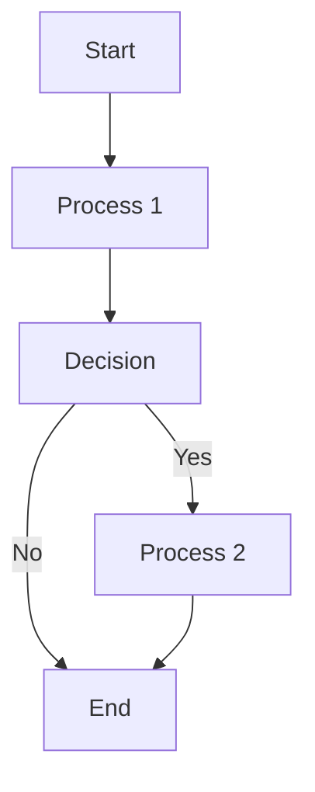

# Here is an index page

Let's make sure we have LaTeX working for math.

$$ \int x^2 dx = {1\over3} x^3 + C $$

Looks good.

## Let's try mermaid for diagrams

```mermaid
graph TD;
    A[Start] --> B[Process 1];
    B --> C[Decision];
    C -->|Yes| D[Process 2];
    C -->|No| E[End];
    D --> E;
```
